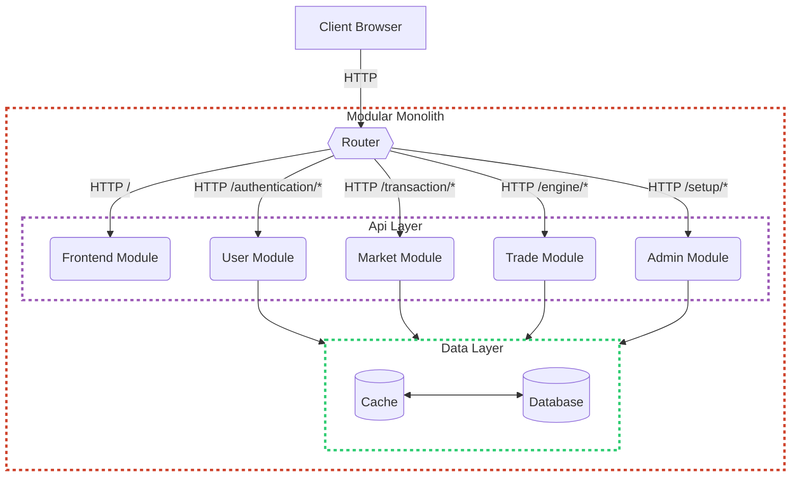

# Trade

[](https://github.com/MNThomson/trade)
[](https://github.com/MNThomson/trade/actions?query=branch%3Amaster)

## Production Deployment

> [!NOTE]
> **BEFORE** you run the following, make sure you have [`docker`](https://docs.docker.com/engine/install/) & the [`docker compose`](https://docs.docker.com/compose/install/#scenario-two-install-the-compose-plugin) plugin installed and running

```shell
git clone https://github.com/MNThomson/trade && cd trade

docker compose up --build
```

The server is now running (give it ~1min to build) and accessible at [http://localhost:3000/](http://localhost:3000/)

## Development Environment

> [!NOTE]
> You'll need [`rust`](https://www.rust-lang.org/learn/get-started) installed

```shell
cargo run  # Default development environment
cargo r    # Faster compile time with hot reloading (requires mold linker & cranelift backend)
cargo t    # Run the integration (correctness) test suite with file watching
cargo c    # Run the clippy linter with file watching
```

### Testing

GitHub Actions will automatically run the entire test suite on each commit as part of each service's workflow. These results can be viewed by clicking on the green checkmark besides the most recent commit on `master` (or alternatively viewed in the `Actions` tab). Run the command `cargo t` to kickoff the 1,000+ lines integration test suite.

## System Architecture


